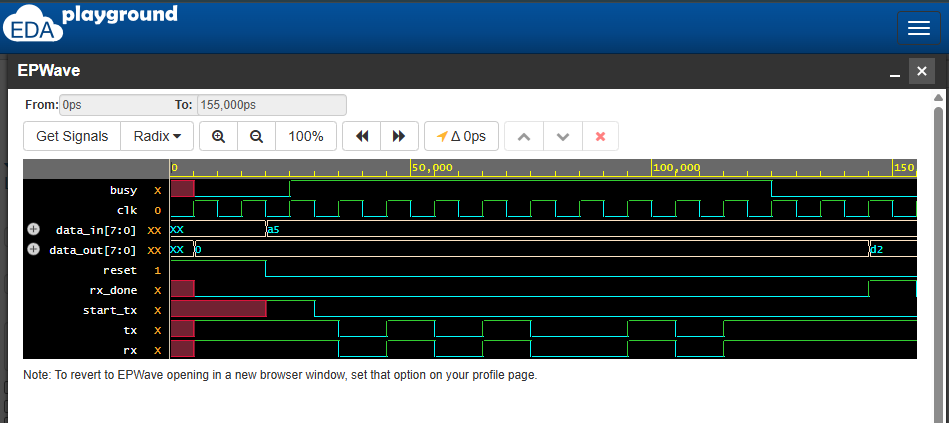

 UART Loopback Simulation (TX → RX)

This project implements a simple UART transmitter and receiver loopback system using SystemVerilog.

=>  Files
- `design.sv` – Contains both `uart_tx` and `uart_rx` modules
- `testbench.sv` – Stimulates the design and connects TX to RX
- `uart_loopback_waveform.png` – Captured waveform showing successful transmission

=>  Waveform

=>  What it Demonstrates
- Serial UART transmission of 8-bit data
- Receiver reconstructs transmitted data via loopback
- FSM-based TX/RX design

=>  Tools Used
- SystemVerilog
- EDA Playground (Icarus Verilog + EPWave)
